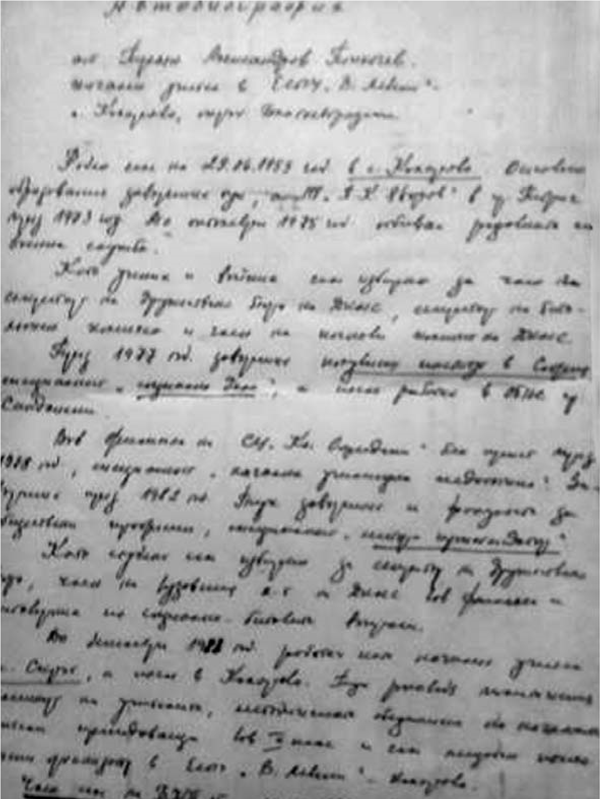

# 42. Партийните и комсомолските секретари от Педагогическия факултет се върнаха отново на власт и превзеха ръководните длъжности в него ?

Това са онези, които водеха явна, а и потайна, нестихваща война срещу мен като
„враг на народната власт“, който имаше смелостта да приложи в универстета Закона
„Панев“ през 1993 г.

В различните катедри на Педагогическия факултет се бяха залостили все ярко
изявени бивши комсомолски и партийни секретари, дошли от къде ли не. И все на
отговорни места. Сред тях беше и бившият секретар на ОК на ДКМС в Горна Джумая
Стоян Иванов.

Спомням си, че когато бях зам.-ректор, един от неговите колеги ми донесе две
големи папки, в които бяха събрани конкретни доказателства за незаконното му
връщане като предишен асистент в университета. Отначало беше гузен за това, но
когато започнаха промените, надигна високо глава и участваше активно и той в
борбата срещу мен за отстраняването ми даже и от факултетния съвет. След това се
стресна, когато Законът „Панев“ му попречи да заема жадувано от него ръководно
място в унивреситета. За мое голямо учудване и той през последните няколко
години набързо се накичи с научна степен и званието професор. А когато се
създаде новият факултет в университета с чудноватото название „Обществено
здраве, здравни грижи и спорт“ през 2009 г., мечтата му се сбъдна и стана негов
декан.

Верен приятел на комсомолския секретар Стоян Иванов отдавна е дългогодишният
секретар на партийната организация в Педагогическия факултет Кирил Костов. Той
пък през 2007 година стана зам.-ректор. След това през 2011 година, когато се
гласеше за втори мандат, във в. Струма излязоха публикации, от които станаха
най-после известни някои от неговите далавери, за които се говореше отдавна.В
една от тези публикации се твърдеше, че синът му е взел 2500 лева от студента
Иван Миков за прехвърлянето му в нова специалност в университета с помощта на
баща му. Стана голям скандал и несменяемият дългогодишен партиен секретар си
подаде оставка като зам.-ректор. След това бившият партиен секретар продължи
отново да сплотява партийната група във факултетния съвет, заедно с неговия
приятел Йордан Колев.

През 2010 година неочаквано почина деканът на Педагогическия факултет доц. Руси
Русев. Комунистите от факултета отново се сплотиха и решиха на негово място да
изберат съпругата на Йордан Колев, която има големи заслуги като завеждащ
организационен отдел в РК на ДКМС в град Кнежа, след което се записва като
студентка в педагогическия факултет на Софийския университет (детски профил).
След една година Маргарита Колева е преизбрана за цял мандат като декан, а за
председател на Общото събрание комунистите стъкмяват своя бивш секретар на
партийната организация във факултета доц. Кирил Костов, най-близкият приятел на
семейство Колеви.

И така, коя е Маргарита Колева, съпругата на най-войнствения борец против
прилагането на Закона „Панев“ през 1993 година?

Отговор на този въпрос се дава в специално изпратената ѝ характеристика от
секретаря на градския комитет на БКП в град Койнаре.

Нейният баща е станал член на РМС още през 1943 година и като такъв по време на
съпротивителното движение е бил помагач. И нещо страшно, много страшно в
произхода на «другарката» на Йордан Колев. Баща ѝ е „участвувал в установяването
на народната власт на 8 и 9 септември 1944 година в Койнаре, Чомаковци, Еница,
Бреница, Лазарово и с. Глава“. Това са най-страшните и кървави дни, през които
без съд и присъда създадените по указание на Георги Димитров от Москва въоръжени
групи от комунисти и ремсисти разстрелват невинни хора. Ето какво научаваме от
книгата на Христо Троански за някои от жестокостите именно в едно от селата на
този край, където е бил бащата на деканката на Педагогическия факултет в
Югозападния университет Маргарита Колева:

„Пребиват тамошните революционери с колове четирима местни жители и хвърлят
труповете им в ямата за умрели от заразни болести домашни животни. Сетне – още
четирима, докарани от съседното село. Подир някой и друг ден играещите наблизо
деца ужасени изпищяват и тичат да разказват у дома какво са видели“ (вж.
Троански, Хр. Убийствено червено. С., 2003 г., с.198).

Сигурно някогашният секретар на РМС, а след това 25 години партиен секретар и
член на ГК на БКП е разказвал на дъщеря си Маргарита и на зетя Йордан за
геройските си дела при установяването на народната власт. Закърмена с неговия
дух.

Най-младият от комунистите в Педагогическия факултет доц. Траян Попокочев беше
избиран за зам.-ректор два мандата от 2007 до 2014 г. Това учуди много
преподаватели в университета, но властта в него беше вече отново червена, а
„несменяемият“ бивш комсомолски секретар даде много от младежките си години за
нея.

Кой е т.нар. от студентите „наперен“ преподавател с прозвището „Белязаният“, при
когото повечето студенти вземаха изпита си много трудно?

Това е сегашният декан на Педагогическия факултет и ръководител на Катедрата по
педагогика. Спомням си, че някога един от моите колеги, известен български
професор от Софийския университет, който беше хоноруван преподавател при нас, ми
каза:

– Атанасе, този наперен асистент има самочувствие, което е фалшиво. От него
преподавател по педагогика не става.

Все още пазя десетките оплаквания на студенти, изпращани до мен като ръководител
на катедрата. Не смея да ги разлистя, защото там се описват неща, от които някои
ще настръхнат. Никога няма да забравя гнева и плача на дъщерята на един от моите
някогашни колеги в град Разлог, която беше принудена да напусне нашия
университет и се премести във Факултета за предучилищна и начална училищна
педагогика в Софийския университет. Този случай беше много неприятен и известен
както на ректората, така също и на студентите. Но нека и този път премълча за
него.

И така кой е „несменяемият“ комсомолски секретар навсякъде, където
и да е бил, а след това и групов партиен отговорник на Катедрата по педагогика?

Спомням си като ръководител на катедрата, че той винаги беше с неизмеримо високо
партийно вдъхновение. Недоумявах откъде идваше то, но веднъж ми представи
автобиографията си и разбрах, че той наистина беше много верен син на „партията
майка.

*Това е автобиографията на сегашния декан на Педагогическия факултет в
Югозападния университет „Неофит Рилски“ Траян Попкочев, ръководител на Катедрата
по педагогика и доскорошен заместник-ректор два мандата*

Като ученик и войник Попкочев е избиран за член и секретар на дружествено бюро
на ДКМС, секретар на батальонен комитет и член на полкови комитет на ДКМС.
Когато завършва полувисш институт за социални дейности, е назначен за директор
на Пионерския дом в Сандански. Тази длъжност му отваря по-лесно вратата за
Висшия педагогически институт в Благоевград, където освен специалност „Начална
училищна педагогика“ завършва и факултета за обществени професии, специалност
„Лектор-пропагандатор“.

Като студент Попкочев е избиран за секретар на дружествено бюро и член на
вузовския комитет на ДКМС. Е, това е голям старт и за лесно вземане на учителско
място в родното му село, където ръководи политическия семинар с учителите.

С всичкия този комсомолски актив Попкочев записва името си за подходящ асистент
във Висшия педагогически институт в Благоевград по специално скалъпената учебна
дисциплина за него „Основи на педагогиката“, за която нямаше необходимите часове
за откриване на конкурс по нея. Но какво да се прави? За такъв заслужил
дългогодишен комсомолски секретар партията беше грижовна.

Е, не мога да отмина и „научното“ израстване на Попкочев в Катедрата по
педагогика, на която бях ръководител.

С немалко нарушения гл.асистент Траян Попкочев се запъти да получи научна степен
и научно звание. Ето как се добра до тях.

Зачислен е на свободна аспирантура за срок от две години на 1.10. 1990 като
дисертант на самостоятелна подготовка на тема „Отношението ценностна система на
възпитание – избор на стратегии на възпитание (в началните класове).
Рецензентите на проекта бяха доц. М. Белова и гл.ас. Н. Чимева, които имаха
съществени критични бележки, които авторът след това забрави.

Бях член на комисията за кандидатския минимум на Тр. Попокочев, който се проведе
на 10.10. 1991 г. Отговорите му бяха незадоволителни, поради което подписах
протокала с особено мнение.

Със заповед на ректора проф. К. Чимев от 25.11.1993 г., Траян Попкочев беше
отчислен от аспирантура с право на защита, считано от 2.10.1992 г. Цели 7 години
Попкочев не предложи дисертация за обсъждане. Чак на 7.6.1999 г. на заседание на
Катедрата по педагогика поиска да му бъдат избрани рецензенти, без да представи
труд за обсъждане в катедрата. Та той беше вече загубил право за защита на
кандидатска дисертация.

На 14.07.1999 Траян Попкочев предложи най-после проект за дисертация, но не беше
направено обсъждане, защото нямаше още избрани рецензенти. На това заседание не
друг, а той си предложи за рецензенти проф. Петър Николов и доц Петър Балкански
за защита на кандидатската му дисертация в Специализирание научен съвет по
педагогика в София. Трябваше първо да се обсъди проектът за дисертация и тогава
да се предложат рецензенти. Такъв друг случай до тогава нямаше в Катедрата по
педагогика.

Гл.ас. Траян Попкочев променя сам темата на своята дисертация, без да има
решение на катедрата и Факултетния съвет. Не ми е известно новата тема да е
обсъждана на заседание на Катедрата по педагогика.

Интересно, след цели три години, чак на 12. 09. 2002 г. Попкочев защитава
кандидатска дисертация на тема „Ценностните ориентации на родители в избора на
стратегии на семейно възпитание“. Остана дълбока тайна това как и защо Попкочев
е сменил темата и кое научно звено е предложило защитата на дисертацията му.

Тежки процедурни нарушения са допуснати и при избора на гл.ас Тр. Попкочев за
доцент. Без да има представен и обсъждан в Катедрата по педагогика самостоятелен
труд, какъвто се изискваше от всички, които бяха избрани за доценти, той беше
избран за такъв, разбира се, с помощта на партийната група в катедрата.

По-късно, вече като ръководител на Катедрата по педагогика и зам.-ректор,
Попкочев продължи да нарушава основните изисквания за откриване на процедура при
получаване на научното звание „Професор“. Не беше представил за обсъждане в
катедрата подадената молба от доц. Снежана Попова за откриване на процедура за
научното звание „Професор“. Тя имаше шест издадени монографии и специално
представена такава за научното звание „Професор“, но ръководителят на катедрата
Попкочев запази процедурата за професор за себе си.

Без да представи специално подготвен хабилитационен труд за това научно звание,
Траян Топкочев подготвя Катедрата по педагогика, която му открива процедура за
професор, за която все още не се знае до къде е стигнала.

Ето, такива са някои от сегашните ръководители в педагогическия факултет на
Югозападния университет, които продължават с макаренковски методи и форми да
обучават студентите. Портретът на прославения съветски педагог Антон Семьонович
Макаренко още виси в една от залите, където чете лекции неговият изследовател
проф. Йордан Колев. За да не се забравя „великият“ съветски педагог от
студентите, Йордан Колев публикува голяма статия за неговата 125-а годишнина от
рождението му в Годишника на Факултета по педагогика през 2013 година.

През 1993 година цялата тази група от партийни и комсомолски секретари беше
засегната от Закона „Панев“ и изолирана от ръководните длъжности в университета.
Това спомогна за създаването на атмосфера за спокойна и ползотворна дейност в
университета. Преодолени бяха трудностите, които се създаваха на безпартийните
преподаватели в тяхното научно израстване. По-късно при управлението на
различните разновидности на комунистически правителства, когато беше провален и
цялостният Закон за лустрация, постепенно бившите партийни и комсомолски
секретари заеха отново ръководните длъжности в педагогическия факултет. В тяхна
помощ бяха и някои неизвестни до тогава агенти на Държавна сигурност, какъвто в
педагогическия факултет се загнезди проф. Петър Балкански, известен с
агентурното име Байкушев. Така се създадоха отново трудни условия за спокойна
работа и заслужено научно израстване на онези безпартийни преподаватели, които
бяха белязани като „непослушници“.

Най-благоприятни условия започнаха да се създават за развихряне на бившите
партийни и комсомолски секретари през 1999 г., когато отминаха мандатите на
ректорското и факултетските ръководства, избрани склед прилагането на Закона
„Панев“. Новият ректор доц. Илия Гюдженов потърси специалната помощ най-много на
комунистите от педагогическия факултет на университета. В другите факултети
нямаше такова явно сплотяване на бивши партийни и комсомолски секретари, защото
такива и преди това се срещаха много малко в тях, а и не бяха така напористи да
заемат ръководни места.  

