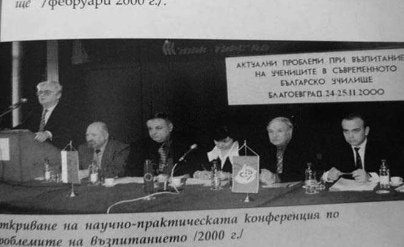

# 43. След пенсионирането ми, продължих да чета лекции като гост професор в Пловдивския университет

Там, където нямаше такава червена свита, се чувствах спокоен и доволен от
преподавателската си работа. Не престанах обаче да отдавам всичко от себе си за
укрепване авторитета на Югозападния университет.

През 2000 година бях научен ръководител на национална конференция на тема
„Актуални проблеми при възпитанието на учениците в съвременното българско
училище“, на която присъстваха изтъкнати университетски преподаватели по
педагогика и психология (професори и доценти) от Югозападния, Софийския,
Великотърновския и Пловдивския университет, водещи учители от страната и
ръководители в образователната система. На конференцията спецален гост беше Ели
Жуан, зам. генерален директор на Интернационала по образованието,
вицепрезидентът на Република България Тодор Кавалджиев, председателят на КНСБ
Желязко Христов, председателят на Синдиката на българските учители Янка Такева и
др. След провеждане на конференцията беше издаден сборник с всички доклади и
изказвания.

Още през първите ректорските години на Илия Гюдженов, Югозападният университет
започна да се тресе от големи скандали, свързани с купуване и продаване на
изпити, с прехвърляне от една в друга специалност, със записвания без полагане
на конкурсни изпити и какви ли не други срамни, но прикривани нарушения. Станаха
съвсем прозрачни имената на някои от приближените на ректора, но той се правеше,
че не се е случило нищо. Затова по-късно се предприеха строги мерки от
Министерството на образованието за прекъсване на обучението на студенти, при
които бяха нарушени академичните правила. Ректорът и този път се представяше за
невинен и стовари цялата вина върху други, един от който след това получи
незаслужени обиди и беше отстранен от Югозападния университет.

Винаги, когато научавах за новите скандали в университета, свързани с
нарушаването на нормите и правилата на академизма, изпитвах болка, която
преживявах болезнено, защото умората от усилията ми да запазя неговия авторитета
още не бе отминала.

През началото на учебната 2001 година не останах безразличен към решението на
ректорския съвет да се обучават в Югозападния университет 500 турски студенти,
които бяха поставили условието да имат и действаща джамия. Тогава си спомних за
някогашните постоянни пътувания на Николай Божков в Турция, където той
подготвяше там да създаде академична пирамида на университета. Сега тази негова
идея се подновяваше и подкрепяше от обкръжението на ректора. Обявих се против
нея, защото Пиринският край не е е най-подходящото място за обучение на 500
турски студенти.

Бях научен ръководител на национални и международни конференции, на които се
разглеждаха изключително актуални проблеми в образованието. За съжаление нито
ректорът, нито неговите заместници се интересуваха от това, което правех.
Техните „грижи“ бяха други.

През 2005 г. бях научен ръководител на национална конференция на тема „Формир
ане на националната идентичност на учениците в българското училище“ с участието
на преподаватели от Югозападния, Софийския и Пловдивския университет,
ръководители в образователната система и учители от различните степени на
българското училище.

През 2006 година под мое научно ръководство се проведе друга национална
научно-практическа конференция в град Пловдив на тема „Съвременни проблеми пред
извънкласната и извънучилищната дейност“, в която участваха университетски
преподаватели, ръководители на окръжни съвети за народна просвета, учители и
много други спциалисти в системата на образованието. Тя предизвика специалното
внимание на Министерството на образованието, което след това отпусна 12 милиона
лева за организирането и провеждането на извънкласната и извънучилищната работа
в българските училища.

И след пенсионирането ми не преставах да бъда близо до моите колеги от Катедрата
по педагогика и да анализираме и осмисляме заедно актуалните проблеми в
педагогическата наука, детерминирани от промените, които ставаха в нашата
страна.

През 2002 и 2003 г. излязоха от печат под мое съставителство двата сборика
„Актуални проблеми в европейското педагогическо пространство“ и „Педагогическата
наука и новите реалности“, в които участваха със свои разработки всички колеги
от Катедрата по педагогика.

През това време напусналият по собствено желание катедрата Йордан Колев
отскачаше от катедра в катедра и си търсеше подходящо място, за да се обсъждат
„трудовете“ му там, където не беше неговото научно направление. Той започна от
Катедрата по предучилищна педагогика. След това, както вече беше подчертано, се
премести със специално поръчение, но незаконно в Катедрата по начална училищна
педагогика. Последва отново преместването му по негово преднамерено желание в
Катедрата по предучилищна педагогика, после пак прелетя в Катедрата по
педагогика, от която се отказа и отново се върна в Катедрата по предучилищна
педагогика. По едно време с проф. Петър Балкански, известен като агент Байкушев,
създадоха нова катедра, в която съвсем произволно бяха включени преподаватели от
различни специалности. И още веднъж се върна в Катедрата по педагогика, когато
вече се бях пенсионирал, но после пак отиде в Катедрата по предучилищна
педагогика при жена му, където е още. Такова гъвкаво премятане от катедра в
катедра, за да се решат по-лесно личните проблеми, не беше познато в
университета.

Необходимо е да се направи специално изследване за всички бивши партийни и
комсомолски секретари, както и за агентите на Държавна сигурност, нахълтали в
българските университети, за да се установи какви са техните родствени корени,
как са попаднали и израснали там, където не им е мястото, и какви са истинските
им приноси при получаване на техните научни степени и звания. Присъствието им в
академичната общност и през годините на посткомунизма е една от основните
причини за подронване на устоите на висшето образование и бягството на
талантливите студенти в чужбина.

*Сега, когато се разхождам тук често ме спират признателните мои колеги,бивши
студенти и граждани, за да ми припомнят какво съм направил за спасяването на
университета от онези, които рушеха авторитета му, а след това се представяха за
негови „строители“.Между надписите на двата университета беше един от кабинетите
ми като ръководител на катедра и зам.-ректор. От него прегръщах с поглед града,
сгушил се в пазвите на планината, и се радвах, че в него израства нашият
университет като огнище за наука, просвета и култура в Югозападна България*

Когато не стихваха атаките на партийните и комсомолските секретари срещу мен, не
беше лесно и на дъщеря ми доц. Снежана Попова. Тя беше тогава гл. асистент по
теория на възпитанието. Катедрата избра рецензентите за защита на докторската ѝ
дисертация на неизследваната до тогава тема „Формиране на половоролева
идентичност на децата от начална училищна възраст (педагогически аспекти)“. След
това обаче предложеният от катедрата рецензент проф. Стефан Чернев, който беше
един от най-известните спецалисти по теория на възпитанието, беше заменен от
тогавашния червен Специализиран научен съвет с бившия партиен секретар от
Биологичния факултет в Софийски университет биологът Александър Панайотов, който
направи отрицателна рецензия.

Блестящата защита на Снежана го прикова и разкри неговото истинско невежество по
отношение на темата на дисертацията. Той замълча и сякаш онемя, когато трябваше
да даде отговор на въпросите на дисертантката, разкриващи съвсем убедително
некомпетентността му в областта на педагогическата наука. Някои от неговите
приятели, които бяха написали рецензията му, се скриха. Снежана беше избрана за
кандидат на педагогическите науки от всички членове на научния съвет. За нея
гласуваха и онези, които бяха предварително уговаряни да гласуват „против“.

Председателят на Специализирния научен съвет проф. Димитър Павлов се обърна към
дъщеря ми и ѝ каза пред всички в залата:

– Колежке, честито! Досега сме нямали такава достойна, истинска защита на
докторска дисертация!

По-нататък обаче партийните и комсомолските секретари в Педагогическия факултет
продължиха да прилагат своя „класово-партиен подход“ и към нея. Направен бе
неуспешен опит и при конкурса ѝ за придобиване на научното звание доцент.
По-късно, когато поиска да ѝ бъде открита процедура за научното звание
„Професор“, доц. Траян Попокочев скри молбата ѝ. Затова пък след това
„несменяемият“ комсомолски секретар си уреди по скоростен начин да му бъде
открита процедура за професор, без да има издаден хабилитационен труд. Конкурсът
му обаче, както вече беше подчертано, се „закучи“ и се влачи и до днес заради
това, че и този път прегази академичните изисквания за даване на научно звание.

