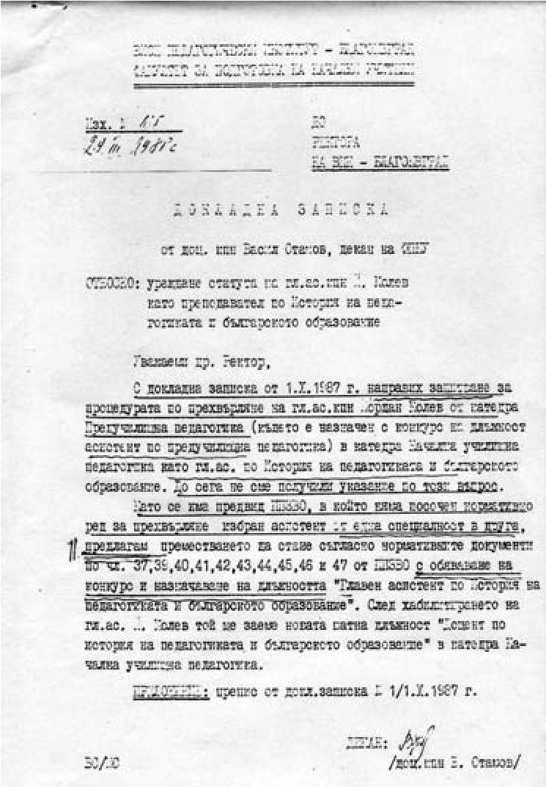

# 5. Неочакваното преместване на гл.ас. Йордан Колев в Катедрата по начална училищна педагогика

На 05.06.1986 година на заседание на Катедрата по начална училищна педагогика
деканът на факултета доц. Георги Стоянов ни изненада, че ректорското ръководство
настоявало да се обяви „спешно“ конкурс за доцент на Йордан Колев от Катедрата
по предучилищна педагогика, която беше към друг факултет. В катедрата имаше само
42 часа упражнения, които бяха в повече, но за лекции нямаше часове, за да се
открие конкурс за доцент. При това положение един от тримата преподаватели по
история на педагогиката трябваше да бъде освободен. Забелязах разочарование от
декана на факултета доц. Георги Стоянов от кадровата политика в института, която
се направляваше от Окръжния комитет на БКП. Катедрата ни беше неприятно
изненадана от потайния напън на Йордан Колев „по спешност“ да нахълта в нашия
факултет. През това време гл. ас. Невена Филипова, преподавателка по история на
педагогиката, беше пред защита на кандидатска дисертация. Затова някои от
колегите смятаха, че напънът на Йордан Колев да се открие специално за него
конкурс е неоснователен. Доц. Мария Белова подчерта, че във Факултета по
предучилищна педагогика не се изучава дисциплината „История на педагогиката“,
т.е. Йордан Колев няма основание да пренебрегва вече натрупаната практическа
подготовка на двете асистентки по история на педагогиката в Катедрата по начална
училищна педагогика – гл.ас. Невена Филипова и Милка Терзийска. На това
заседание катедрата единодушно реши:

„Тъй като сега няма часове по история на педагогиката, няма нужда да се обявява
конкурс за доцент“.

Въпреки това решение на катедрата Йордан Колев тръгна, за да постигне целта си.
Аз бях силно изненадан от този подход на непознатия за мен Колев в неговата
научна кариера. Един от колегите ме уверяваше, че ако той нахълта в катедрата,
ще поведе напориста борба за заемане и на ръководни длъжности във факултета.
Разбрах, че както деканът доц. Георги Стоянов, така и ръководителят на катедрата
доц. Мария Белова подозираха какво може да се случи в катедрата, ако Йордан
Колев бъде преместен в нея. Може би затова те изпревариха с два-три месеца
незаконното му прехвърляне от Катедрата по предучилищна педагогика в Катедрата
по начална училищна педагогика и напуснаха Висшия педагогически институт.

Един ден доц. Георги Стоянов ми каза направо в очите:

– Пази се от него, Атанасе!

Той го познаваше и от него научих, че не е бил съгласен с тогаваш-
ното окръжно партийно ръководство, което е проявило авторитарно действие в
противовес с академичната автономия на Висшия педагогически институт.

След напускането на доц. Мария Белова бях избран за ръководител на катедрата, но
факултетният комитет на БКП задържаше издаването на заповедта за назначаването
ми. Така, без издадена заповед, изпълнявах длъжността ръководител на катедра в
продължение на три години. Може би една от подготвените ръководни длъжности за
Колев е била именно тази.

През октомври 1987 г. гл. ас. Йордан Колев по разпореждане на ректорското
ръководство, в нарушение на Закона за висше образование и Правилника за неговото
прилагане, беше прехвърлен в Катедрата по начална училищна педагогика за
преподавател по история на педагогиката и българското образование. Новият декан
на факултетът доц. Васил Стамов изпрати докладна записка за допуснатото
нарушение до ректора, но отговор не беше получен в продължение на две години.
През това време, без решение на катедрата, беше открита и процедура за доцентура
на известния тогавашен секретар по идеологическите въпроси на вузовския комитет
на БКП Йордан Колев.

Взаимоотношенията между преподавателите в катедрата, на която бях ръководител,
бяха спокойни до появяването на гл.ас. Йордан Колев. Преди това на заседание на
катерата бе обсъдено както неправилното преместване на Колев, така и откритата
му процедура за доцент. Нямаше решение нито на Катедрата по предучилищна
педагогика, нито и на Катедрата по начална училищна педагогика, както и на
факултетните съвети. По-късно тогавашният ръководител на първата катедра доц. Ф.
Даскалова в специално писмо от 31.03.1993 г. до ректора на университета даде
следния официален отговор:

„Катедра „Предучилищна педагогика“ не е обявявала никакъв конкурс (към датата на
издаване на заповедта). Никъде и никога катедрата не е заявявала – нито
официално, нито неофициално, необходимостта от назначаване на преподавател по
история на педагогиката към катедрата. Всъщност членовете на катедрата са
убедени, че обявяването на конкурса за доцент по история на педагогика в ДВ, бр.
23 от 24.03.1987 г. е направено по предложение на Катедрата по педагогика по
изричното настояване на проф. Белова и доц. Стоянов“.

От писмото на доц. Ф. Даскалова става съвсем ясно, че процедурата на Й. Колев не
е била открита и в Катедрата по предучилищна педагогика. Съвсем неоснователно тя
твърди обаче, че процедурата е открита в Катедрата по начална училищна
педагогика, защото на заседание на Катедрата по педагогикана 05.06.1986 г.,
както вече бе подчертано, бевзето следното решение:

„Тъй като сега няма часове по история на педагогиката, няма нужда да се обявява
конкурс за доцент“ (вж. протокол № 11 от 05.06.1986 г.), подписан от
протоколчика ас. Траян Попкочев, сегашен приятел на Колев от най-близкото му
обкръжение.

Това бе едно от поредните закононарушения, което е свързано с научната кариера
на секретаря по идеологическите въпроси във ВК на БКП Й. Колев, за което се
споменава в следните две докладни записки на декана на Факултета за начална
училищна педагогика доц. Васил Стамов.

Заедно с незаконното прехвърляне на Й. Колев в катедрата, неочаквано за мен, от
НИИО „Тодор Самодумов“ бе спусната пак с партийно поръчение и н. с. Лиляна
Тодорова, известна като „специалист“ по теория и методика на ДПО „Септемврийче“
и четите „Чавдарче“. И за нея нямаше решение както на катедрата, така и на
факултетския съвет. През декември 1986 г. тя беше избрана от Катедрата по
начална училищна педагогика само като лектор по съществуващата тогава дисциплина
„Работа с четите „Чавдарче“.

Вече представил се на някои колеги в катедрата като секретар по идеологическите
въпроси на ВК на БКП във Висшия педагогически институт, Йордан Колеввъобще не се
вестяваше в катедрата. Когато гопопитах защо не идва на заседанията в катедрата,
той ми отговори високомерно:

&minus;Ти знаеш ли с кого разговаряш? Скоро ще разбереш. И тогава тежко и горко ти!

&minus;Е, кой си? – попитах го.

&minus;Направиха ми две предложения. Едното е свързано с борбата, която водя в
    партийното бюро срещу Никола Лазаров. Ще победя и ще бъда първи секретар на
    ВК на БКП в института. Така че внимавай как се държиш с мен. Не приемам да
    ми бъдат поставяни задачи. Такива аз ще поставям.

В института всички знаеха за тежката война за лидерското място във ВК на БКП
между Йордан Колев и Никола Лазаров. За да ги помирят, бяха дошли Хр. Христов и
Начо Папазов от ЦК на БКП. Никола Лазаров не издържа и заболя.

&minus;Кое е другото предложение? – попитах Колев.

&minus;То е още по-отговорно. Директорът на политическия затвор в Пазарджик Ангел
    Топорчев е повишен. Изпращат го в Централния затвор. Предлагат ми да заема
    неговото място.

Като чух за намеренията на Колев да стане директор на един от най-свирепите
политически затвори у нас, онемях. Разбрах, че до мен стои човек, с когото сме
от два различни свята. По-късно той отрече, че е споделил това с мен . На едно
от съдебните дела, което водеше срещу мен, представи удостоверение № 1363 от
22.10.1992 г. от затвора в Пазарджик, в което е написано, че „няма данни Йордан
Колев да е подавал документи за постъпване на работа в затвора за длъжността
директор на Пазарджишкия затвор“. По-нататък в писмото обаче се казва, че
назначаването на директорите на затворите се е извършвало от Главно управление
на местата за лишаване от свобода към Министерството на вътрешните работи,
поради което могат да се изискат данни от отдел „Кадри“ на ГУМЛС в София.

Та кой комунист в миналото представяше молба, за да заеме определено ръководно
място? Нали БКП изпращаше своите кадри там със специално поръчение.

По-късно в своя критичен материал „Врагове на демокрацията“ Кристина Илиева (в.
Век 21) направи анализ на публикациите на Й. Колев, отпечатани във в.“Съвремие“,
издание на общинския съвет на БСП в Благоевград. В една от тях (“О, времена, о,
нрави“), нахвърляйки се срещу страдалците от лагерите и затворите, Колев се
обръща към тях с думите: „Вие сте срам за човешкия род и трябва да изчезнете не
само от политическия живот“. Авторката възкликва: „И тази закана е изречена от
„учен“, който е призван да подготвя педагогически кадри! Ами ако наистина беше
станал някога директор на политическия затвор в Пазарджик, сигурно в човешкото
страдание щеше да има още един черен кръст „.

Най-после, неочаквано, Йордан Колев се появи на едно от заседанията на
катедрата. Когато другите колеги отчитаха своята дейност, вирналият надменно
глава мераклия за първи секретар на ВК на БКП, или пък за директор на
политическия затвор в Пазарджик, започна да се оправдава за несвършената работа,
свързана с изоставения кабинет по педагогика. Нахвърли се срещу ст. ас. Милка
Терзийска. По същия начин постъпи и с другата си колежка гл. ас.Невeна Филипова.
Когато някои колеги, без да се страхуват, му отправиха някои критични бележки,
той започна да говори за борбите, които води с негови колеги от партийния
комитет за първото място, което се гласеше да поеме там. Намесих се в техния
разговор и казах на Колев:

&minus;Не е необходимо да се правят изявления за водене на борби и за победи.
    Умолявам ви в Катедрата по педагогика да не водите подобни борби и да не
    настройвате хората, да не им давате лоши съвети, а да помогнете за
    сплотяването им (вж.протокол №12 от 06.12.1988 г. на катедра Начална
    училищна педагогика).

След това Колев премести неистовата борба от партийния комитет, за да стане
първи секретар на ВК на БКП, в катедрата. Започна потайно, както партията го
беше научила, да настройва някои от колегите срещу мен, да ги съветва какво да
се направи, за да се извърши преврат във факултета. Може би това е било и
поръчението на партията на Колев в навечерието на посткомунистическия преход,
който вече беше моделиран от неговите създатели. Към него се присъединиха
партийният секретар на Факултетният комитет на БКП Кирил Костов и някои от
членовете на партийното бюро. Направи ми впечатление, че Колев вече не плашеше
като евентуален директор на Пазарджишкия затвор, за ужасите в който научих много
от моя състрадалец Аксийски, когато бях в черната рота в Люти дол, Врачанско, а
се подготвяше за превземането на деканския престол във факултета.

И така, в катедрата, на която бях ръководител, се събраха двамата несменяеми
комсомолски и партийни деятели Й. Колев и Л. Тодорова. Не ми беше лесно да се
сработвам с тях. На когото не му се е случвало да работи заедно с бивши партийни
и комсомолски секретари, той нищо не знае за непоносимото тоталитарно време.

След като кацна в катедрата, няколко пъти Колев идваше в кабинета ми. Отначало
ми се оплака, че проф. Жечо Атанасов отказал категорично да му бъде рецензент.
Когато се срещнах с професора, той ми каза шеговито:

&minus;От Колев може да стане монтьор, но не и учен, защото в неговата дисертация,
    както и в няколкото му публикации, прави монтаж на чужди мисли и идеи, а
    няма свои.

Професор Атанасов ми напомни за отрицателната рецензия на проф. Вера Бойчева за
кандидатската дисертация на Йордан Колев, след което е бил специално назначен за
негов рецензент проф. Ангел Въков от Академията за обществени науки.

Приех молбата на Колев един от рецензентите му да бъде ст.н.с. Димитър Дончев,
за когото той настояваше, поради отказа на проф. Ж. Атанасов. Другият рецензент
проф.Елка Петрова вече беше подготвена от семейство Колеви. На няколко пъти
Дончев се срещна с мен и ме умоляваше да се помогне на Колев. Не знам как и по
какъв начин, но и той вече беше превзет.

Цели две години Йордан Колев бе почти „мъртва душа“ в живота на катедрата.
Оживяваше само тогава, когато се беше наканил да се заяде за нещо или да
подстрекава някого срещу мен.

Все още си остават неизвестни кукловодите на кадровите промени във Висшия
педагогически институт през годината на вътрешния преврат, който извърши
комунистическата партия в страната. Спомням си какво оживление имаше сред
партийния актив в института при организацията и подготовката на Общото събрание.
Гузни заради предишния си партиен актив, някои от тях се представяха за
перестройчици, т.е. за новите „демократи“. Именно те вече бяха подготовили
списъците на преподавателите, които трябваше да бъдат в новите ръководства на
института. Под достойнството ни беше да правим това, което те вършеха пред очите
ни за предстоящите избори. Гледах и не исках да повярвам, че университетски
преподаватели могат да имат такова поведение пред очите на студентите, които
обучават.

През тези трудни години имаше нещо, което ме вдъхновяваше в цялостното развитие
на Висшия педагогически институт. То беше тясно свързано с вече покълналите идеи
за прерастването му в университет. В това отношение ректорът проф. Петър Николов
безшумно беше впрегнал мислите си за разширяването на специалностите и
факултетите, които по-нататък станаха и основата за изграждането на
университетската структура на института. Още от тогава той приемаше с голям
интерес всяка идея в това отношение. Спомням си, че когато му изпратих моето
предложение за създаване на факултет по изкуствата, в който да се използва
постигнатото до тогава в Полувисшия институт за подготовка на
културно-просветгни кадри, той прояви изключително голям интерес към тази моя
идея и я подкрепи ревностно. Бях изненадан, че ректорът на няколко пъти
изпращаше писма, адресирани до него, но бяха предавани на мен, за да дам аз
отговор.

Това споделих с мой близък колега, който ми каза, че така ректорът проучвал
онези, които той търсил като заместник-ректори. Такова желание нямах при
създадената атмосфера в института.

Скоро по партийна линия се намери за зам.-ректор гл.асистент Димитър Милиев. Той
стана известен с „блокадното време“ в своя кабинет. Никой нямаше право да чука
на вратата му, за да не го безпокоят. Разнесоха се зли слухове за онези, които
се редували със специален пропуск да нарушават „блокадното време“. Все още пазя
оплакването на студентката Василка Лилова на цели две страници, която е
преживяла много неприятни изпитни терзания в кабинета с „блокадно време“.

Същият този зам.-ректор, който имаше „блокадно време“ в кабинета, се включи
активно в червените атаки срещу мен, заедно с жена му, която беше журналистка.  

