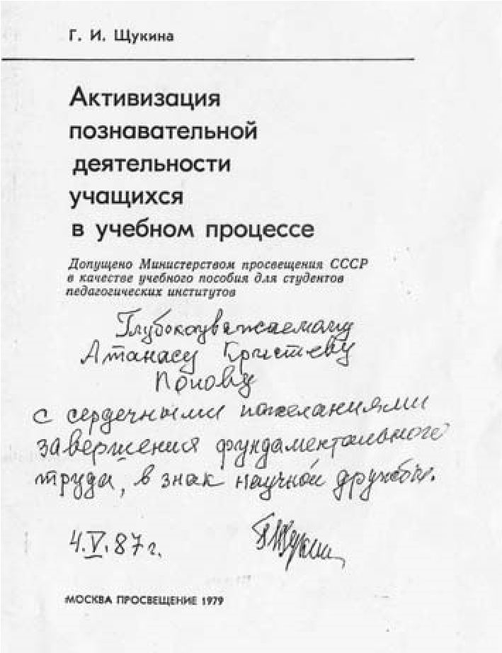

# 6. Висшият педагогически институт имаше договорни взаимоотношения в чужбина само с педагогическите факултети на университетите в Москва и Петербург

През 1986 година беше завършено строителството на основната част на първия
корпус, където беше преместено ректорското ръководство. Някои недоумяваха и
обвиняваха неоснователно ректора Петър Николов, че бърза да се настани в новата
сграда преди да бъде преместен там някой от факултетите. След това обаче, когато
се поставиха основите и на другите сгради в този корпус, стана ясно, че ректорът
има голямата грижа за тяхното по-бързо изграждане, където да се преместят
факултетите.

Както още от създаването на Висшия педагогически институт, така също и след 1986
година продължиха взаимните посещения на преподаватели от нашия и сродните
педагогически факултети в Петербург и Москва. Бях приятно изненадан от
признанието на колегите от чужбина, че дадоха висока оценка на някои от моите
монографии, в които за първи път в педагогическата наука изяснявах конкретно
основните компоненти в структурата на възпитателния процес, както и техните
връзки и взаимоотношения. Никой дотогава не бе изследвал, например, същността,
спецификата и жанровото разнообразие на формите за възпитание, чрез които се
оказва конкретното възпитателно въздействие .

През началото на 1987 година постъпи предложение от Педагогическия факултет на
Петербургския университет за обмяна на моя опит, свързан с последните ми научни
изследвания. Със заповед на Министъра на народната просвета проф. Димитър Бучков
бях изпратен за 45 дни в Педагогическия институт „Херцен“. Получи се парадоксът,
че се водех на специализация по темата „Формата за възпитание като педагогическа
категория“, а руските колеги все още нямаха задълбочени изследвания в тази
област. Именно затова вместо аз да проучвам техния опит, те се запознаваха с
моя.

Един ден проф. Зинаида Василева, ръководител на Катедрата по педагогика, ми
каза, че т.нар. „страшилище“ в педагогическата наука академик Г.И.Щукина е
научила за някои от моите научни изследвания и иска да се срещнем. Когато
започна разговорът ми с нея, я попитах:

&minus;Академик Щукина, а защо все още и вие бъркате, а понякога и неправилно
    уеднаквявате някои от компонентите на възпитателния процес, каквито са
    средствата, методите и формите, които имат относително самостоятелно място в
    структурата на възпитателния процес и специфично семантично значение.

    Щукина сви вежди. Професор Зинаида Василева погледна към мен и повдигна
    ремене като знак на учудване. Разбрах, че трябва и двете да ги убедя, че
    тези понятия не бива да се уеднаквяват. Дадох конкретен пример. Казах, че
    художественото слово е средство, а един от начините на неговото използване е
    рецитирането, което е метод, а рециталът е формата на възпитателно
    въздействие, която ги включва в своята структура.

След този пример, който дадох академик Щукина промени погледа си.

Стана, приближи се до мен и ми каза:

&minus;Много сте точен и убедителен. Вие сте филолог, нали ?

&minus;Да, първо завърших българска филология, а след това педагогика.

&minus;За всеки истински педагог това е най-доброто съчетание – каза Щукина, след
    което продължи да ме разпитва за последните ми научни изследвания.

Показах ѝ ръкописа на монографията, която подготвях за печат. Помоли ме да я
оставя, за да я разгледа по-задълбочено. Прочете на глас заглавието
„Комплексно-интегративният подход във възпитанието“ и се обърна към проф.
Зинаида Василева. Поклати глава и каза:

&minus;Василева, Атанас и тук търси разликата в семантиката на понятията, които ние
    понякога бъркаме. И не само ние, а и някои от другите наши колеги.

Наистина, тогава, според мен, неправилно се уеднаквяваха определенията
„комплексен“ и „интегративен“. Затова по-късно моите рецензенти високо оцениха
научните стойности на монографията ми „Комплексно-интегративният подход във
възпитанието“.

През пролетта на 1988 година по инициатива на Катедрата по педагогика и
Министерството на народната просвета подготвихме и проведохме научно-практическа
конференция, посветена на проблемите на подготовката на бъдещите учители, които
се очертаваха съвсем явно при условията на започналите промени и в
общественополитическия живот у нас. Участваха и преподаватели от сродни висши
институти от бившите социалистически страни Чехия, Унгария, Германската
демократична република и някои от съветските републики. На тази конференция се
прокраднаха и идеите за промяна на силно политизираната педагогическа подготвка
на студентие, която се осъществяваше от преподавателите по идеологически
дисциплини. В нашата катедра пристигна като гост проф. А. Габронидзе от
Батумския държавен педагогически институт. Тогава беше изляза монографията ми
„Форми за възпитание“. На бюрото имах само сигналната първа бройка. Гостът ми се
вторачи в нея и ми каза:

&minus;Даваш не даваш, вземам я! Такъв научен труд у нас все още няма!

На следващия ден на научната конференция пред всички участници той призна, че е
извършил „кражба“ от моя кабинет като взел сигналния брой на монографията ми.
Гостът подчерта, че „в теорията на обучението е известно, че основната форма на
обучение е урокът, но в теорията на възпитанието такова изследване за формите на
възпитание не е направено“.

>   *В автографа, който ми даде на своята книга, Г.И.Щукина определи моногрфията
>   ми „Комплексно-интегративният подход във възпитанието“ като фундаментален
>   труд в педагогическата наука*

След конференцята проф. Габронидзе ме попита не се ли страхувам, че съм
„захвърлил“, както каза той, определението „комунистическо“ в заглавието на
монографията ми „Форми за възпитание“. Усмихнах се, защото бях вече дал отговор
на този въпрос на партийния секретар в нашия факултет. Той ме хвана за рамото и
прошумоли в ухото ми:

&minus;Смелчага си ти, колега! И все пак, пази се!

След това в сп. „Народное образование“ от 28.06.1988 г. в своя публикация проф.
Гобронидзе пише: „На протяжении прошедших 70-ти лет можно было сделать гораздо
больше. Например, в теории обучения известно, что основной формой обучение
является урок, но в теории воспитания такое еще не установлено и были
интересными, в етом плане, поиска болгарского ученого доцента Атанаса Попова,
каторый работает как раз над этими актуальными проблемами“.

През следващата година бях поканен, заедно с проф. Марин Андреев и доц. Тодор
Ангелов, на международна научна конференция в Москва, където се представих с
доклад на тема: „Възпитанието като обществено явление“. И тук за моя приятна
изненада бях посрещнат с изключително внимание от всички участници в
конференцията, които бяха представители от различни европейски страни. Тогава
вече перестройката в Русия беше започната и смело се споделяха новите идеи,
свързани с проблемите на възпитанието. Моят доклад беше след основния доклад на
конференцията. В него разглеждах интегративните връзки и взаимодействия на
възпитанието като обществено явление с политиката, правото, морала, религията и
изкуството. Бях отрупан с въпроси, предизвикани от решителността ми да разкрия
пакостното свързване на възпитателния процес в бившите социалистически страни
единствено с политиката на комунистическите партии.

След разгорещените разисквания трима от руските колеги ме помолиха да се срещнем
през следващия ден, за да продължим разговора по предизвикателната тема на
„сигурно място“. При мен дойде тогавашният гл.секретар на Министерството на
просветата доц. Тодор Ангелов и ми каза:

&minus;Моля те, внимавай, защото и тук ги има такива като тези, които в България те
    дебнат непрекъснато!

Това беше времето на т.нар „гласност“ и „перестройка“ в бившия Съветски съюз,
когато след дългогодишната цензура и ограничаване свободата на словото вече
можеше да се изразява свободно собствено мение. У нас обаче Държавна сигурност и
партийната номенклатура продължаваха да преследват „враговете на народната
власт“, които изразяваха собствено мнение в това отношение. Като такъв бях
вписан в техните оператавни дела и списъци.

Забелязаните промени в Русия ми даваха все по-голям кураж в преподавателската ми
работа. Правех съпоставка на това, което видях там, и това, което продължаваше у
нас. Никога няма да забравя това, което ми се случи при едно от следващите ми
посещения в Москва по покана на Московския държавен педагогически институт,
когато с проф. Димитриев подготвяхме съвместния научен сборник „Формиране на
социалноактивна личност в начална училищна възраст“, публикуван по-късно през
1993 година.

Един ден, привечер, проф. Димитриев ме заведе в центъра на Москва, западно от
Кремъл, където беше „бунтарската“ улица на московчани „Арбат“. Там се струпваха
много хора, недоволни от съветската власт. Гледах тези „непокорници“, слушах
гневния им глас и си мислех за все още непокътнатия режим на Тодор Живков в
България. Не се сдържах и на чист български език се провикнах:

&minus;Защо? Защо и у нас няма още улица „Арбат“?

Един телевизионен екип тръгна към мен и камерата на оператора се изпречи
пред лицето ми. Професор Димитриев свали шлифера си и ме покри с него. Скри
ме и уплашен ми каза:

&minus;Атанасе, пази се! Като бях при вас в Благоевград, научих, че вашите партийни
    ръководители не те обичат. Някои ми казаха да не ти се доверявам много,
    защото не си бил „наш човек“.

Проф. Димитриев беше напълно прав. Съвсем явно наруших строгото изискване на
партийното ръководство да съгласувам дейността си с него.

През 1988 и началото на 1989 година забелязах уплах от промените в страната у
някои от секретарите и членовете на ВК на БКП в университета, партийните бюра
във факултетите и т.нар. групови отговорници в отделните катедри.

На 9.10.1989 г. преселеният с партийно поръчение в нашата катедра Йордан Колев
подаде молба до ректора на университета за издаване на служебна характеристика
за участие в конкурс във факултета за начална училищна педагогика в София. Някои
от колегите в катедрата дойдоха при мен и ми казаха, че той се уплашил като
доскорошен секретар по иделогическите въпроси във ВК на БКП в университета от
промените в страната и е решил да се скрие в София при някои от неговите
приятели.

Презтова време Окръжният комитет на партията беше привикал своите кадри от
университета и ги беше уверил, че промените в страната пак ще ги направи
партията майка. Тогава Колев се успокои и се отказа от конкурса за преместването
му в София. Двамата със секретаря на партийната организация във педагогическия
факултет Кирил Костов получиха конкретни задачи, свързани с кадровите промени в
университета, които започнаха да изпълняват заедно с първия секретар на
вузовския комитет на партията Димитър Стоилов и Николай Божков, които след това
поведоха специално подготвени студентски групи на протестни шествия като
перестройчици.  

