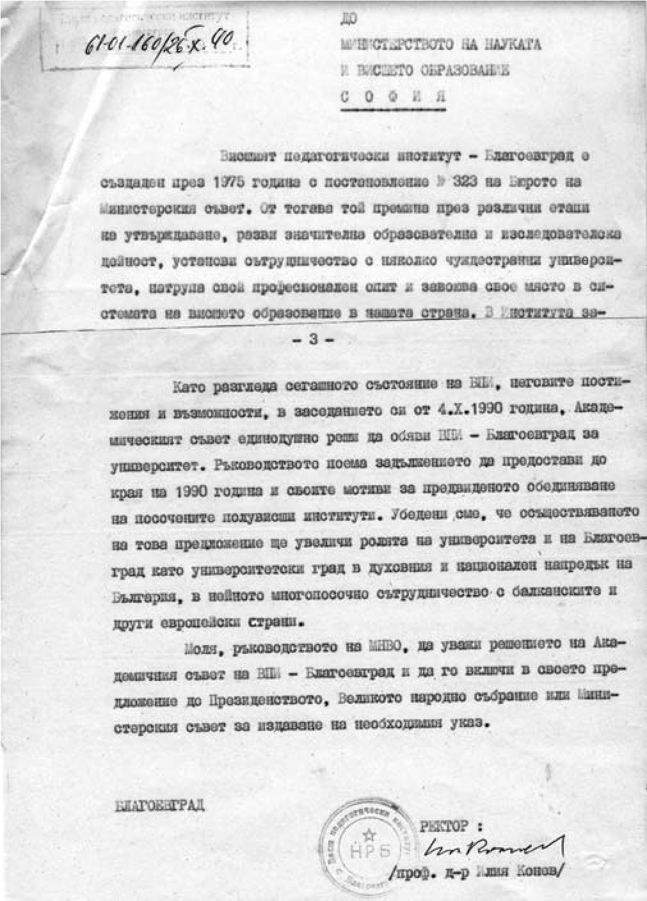

# 7. Червеното лице на „перестройката“ във Висшия педагогически институт

Началото на новата учебна 1988-1989 година започна в напрегнато очакване на
промените, които се извършваха в цялостния живот в страната. В нашия институт
поутихнаха партийните боричкания за първото място във Вузовския комитет на БКП.
Перестройката сепна членовете на партията и те често се събираха, за да обсъждат
новите директиви, според които те трябваше да изпълняват вече ролята им,
свързана с преоценка на „развитото социалистическо общество“ и поемане пътя към
демокрацията, но моделиран пак от тяхната партия.

Цялата учебна година мина неспокойна във Висшия педагогически институт.
Партийните и комсомолските организации изпълняваха повече новите задачи,
поставени от ЦК на БКП, отколкото актуалните проблеми в образователния и научен
процес. Те подготвяха своето ново място в управлението на института, но вече
като „перестройчици“.

Борбата на комунистите и комсомолците в института за превземането на ръководните
места в катедрите, факултетите и ректората започна с ускорени темпове. През м.
октомври 1989 г. се проведе в 201 зала Общото събрание на Висшия педагогически
институт. Градският комитет на БКП взе активно участие в неговата подготовка за
избор на ново ректорско ръководство. Ректорът проф. Петър Николов направи
задълбочен анализ на учебната, научната дейност и на започнатото разширяване на
материалната база на института.

Анализът в доклада на ректора даде основание да се обсъждат перспективите в
развитието на Висшия педагогичски институт. В това отношение се очертаха две
основни становища.

Едното бе свързано със запазването на педагогическия профил, а другото – със
създаването и утвърждаването на нови специалности и факултети, които да оформят
университетския облик на института. Първото становище поддържаха повечето
преподаватели, които бяха завършили специалност „Педагогика“ в Софийския
университет, а другото – онези, които имаха получено друго висше образование и
бяха с по-широк поглед в образователната система. Моето становище беше вече
изразено в подкрепа на онези колеги, които бяха за създаване на университетска
структура на Висшия педагогическия институт. Завършилите само педагогическия
факултет в Софийския университет, който подготвяше и „специалисти“ като
ръководители на четите „Чавдарче“, ДПО „Септемврийче и комсомолски организатори
шумно и напористо защитаваха единствено педагогичските специалности.

На това Общо събрание бяхме един до друг с проф. Илия Конев, който беше отскоро
назначен за преподавател в специалността „Български език и литература“. Често
разговаряхме с него за прадядо ми Георги Иванов Зимбилев. Като изявен
изследовател на Възраждането в България Конев познаваше неговото просветно дело
в Източна Македония, където създава първите новобългарски училища.

Когато започна изборът за Академичен съвет, споделих с него, че няма да бъдем
избрани няколко преподаватели, от които „перестройчиците“ от партийния актив се
страхуваха. Техните „десетари“ вече бяха манипулирали по-голямата част от
преподавателите. Той не искаше да повярва. Но след като съобщиха резултатите от
избора, ме погледна и попита : – Как може? Това е безумие!

Не му дадох отговор, защото трябваше да му призная, че предусещах обезличаването
на академизма от онези, които партията на комунистите смяташе за свои верни
синова и дъщери. На нас, безпартийните, тя гледаше като на врагове, без които
обаче все пак не можеше.

Наистина, в Академичния съвет не бяха избрани едни от най-изтъкнатите
преподаватели в института, които не членуваха в комунистическата партия, измежду
които чл.кор. Евгени Головински, проф. Трифон Трифонов и други изтъкнати учени.
Един от неизбраните бях и аз. Проф. Конев ме погледна с недоумение и прошепна:

&minus;Кой направи тази чистка?

Той още не искаше да повярва, че „перестройчиците“ грижливо подготвиха всичко.
Те бяха кукловодите на прехода в института.

Познавах проф. Конев като изтъкнат български учен, известен и в чужбина. Освен
това се отличаваше със завидна нравствена култура. Затова го помолих да се
изкаже. Той се притесни и ми каза, че чувства неудобство, заради това, че все
още е непознат. Но все пак се реши и направи мъдро изказване, в което наблегна
на необходимостта от превръщането на педагогическия институт в университет.

На първото Общо събрание на Висшия педагогически институт бяха предложени
кандидати за ректор от ОК на БКП, но те не бяха избрани. Тогава няколко колеги,
незабелязано от „перестройчиците“, издигнахме кандидатурата за ректор на проф.
Илия Конев, но без одобрението и съгласието на ОК на БКП това не можеше да
стане. Именно затова Общото събрание се отложи, след което присъстващият
секретар на Общинския комитет на БКП Йордан Топалов започна проучването за проф.
Илия Конев.

На 8 ноември 1989 г. професор Илия Конев беше избран единодушно за ректор от
повторно проведеното Общо събрание. Първите дни на новото ректорско ръководство
на Висшия педагогически институт съвпаднаха с големите промени в страната,
моделирани предварително от БКП, които се определят като началото на прехода от
тоталитарно към демократично развитие на страната. Този „преход“ в нашия
институт беше подготвен от бивши партийни и комсомолски секретари.

Още през първите дни като ректор проф. Илия Конев предизвика необходимата
проверка на материалното имущество на Висшия педагогически институт. Отдавна се
говореше за присвоени и пренесени в апартаментите на някои преподаватели битови
предмети и ценна апаратура, която новият ректор настояваше да бъде върната. Но
това нареждане не беше изпълнено. То обедини засегнатите, които тръгнаха на
„поход“ срещу новия ректор.

Когато проф.Илия Конев започна истинската подготовка за откриване на нови
факултети и обновяването на някои специалности, което беше изключително важно
условие за превръщането на Висшия педагогически институт в университет, т.нар.
„педагози въобще“ открито се обявяваха против тази идея и заявяваха, че е
по-добре да си останем като педагогически институт. С такъв призив скандираха и
заблудени студенти, които бяха зомбирани от несменяемия декан на
Инженерно-педагогическия факултет доц. Николай Божков, който понякога ги
подкрепяше с пържоли, банички, цигари и бира. Галеничето на Сава Гановски
опъваше двата си пръста и беше водач на студентските и преподавателски походи в
Благоевград срещу комунистите, на които вярно и предано служеше само допреди
няколко месеца.

Един ден проф. Конев дойде при мен и скришом ме вкара в неговия кабинет, защото
перестройчиците го дебнеха на всяка крачка.

&minus;Атанасе, липсваш ми! Трябват ми такива преподаватели като теб, с които да
    направя пътя към университетската структура на Висшия педагогически
    институт. Сега разбирам защо те отхвърлиха от състава на Академичния съвет.
    Те се уплашиха, че ще те направя един от моите заместници. Ти си силен и
    имаш възрожденска закваса, каквато сега ни е толкова необходима. Няма да
    скрия, че мисля как да го направя това и сега.

Слушах проф. Конев и се взирах в уплашения му поглед. Той беше с вързани ръце и
прикована мисъл. Какво можеше да направи, за да осъществи хубавите си идеи,
когато срещу него всеки ден започнаха да се публикуват пасквили в местния
периодичен печат. Перестройчиците превзеха и студентския вестник „Обектив“, на
който главен редактор стана Никола Стоянов, политически сътрудник на секретаря
на ОК на БКП Лазар Причкапов. В редакционната колегия беше секретарят по
идеологическите въпроси към ВК на БКП Йордан Колев, както и някои други
комунисти. В една от поредните публикации срещу ректора в студентския вестник се
използваха тежки, непоносими обидни квалификации. Злосторниците стигнаха до там,
че смениха фамилното му име Конев с „Магарев“.

Въпреки големите трудности проф. Илия Конев успя да проправи пътя за създаването
на Югозападния университет. Направи предложение пред Министерството на науката и
висшето образование за обявяване на решение за университетска структура.
Прескочи се обаче предвидената в закона процедура, която изискваше решение на
Народното събрание за признаване на Висшия педагогически институт като
университет.

Когато проф. Конев изпрати писмото до Министъра на науката и висшето образование
проф. Георги Фотев с молба да предложи на Президенството, Великото народно
събрание или Министерския съвет да бъде издаден Указ за утвърждаването на
Югозападния университет, ми донесе копие от писмото. Разгледах го и му казах:

&minus;Професоре, според мен само Народното събрание може да вземе решение за
    утвърждаване статута на нашия университет. А сега там още не ни разпознават
    като сериозни кандидати. Трябва да се търси сигурно лоби.

Проф. Конев ме хвана за рамото, погледна ме в очите и отново ме помоли да му
помогна, да се съглася да се заема с тази нелека задача. Уверих го, че заради
мен червените ще настръхнат и ще го провалят като ректор.

&minus;Атанасе, кажи на кого да се опра? Всички са настръхнали срещу мен. Трябват
    ми истински помощници, за да довършим хубавото дело докрай.

През есента на 1990 г. проф. Илия Конев предложи на обсъждане наименованието и
патрона на бъдещия университет. Постъпиха различни предложения, но най-подходящо
се оказа становището на ректора и на двамата специалисти по история на
педагогиката доц. Георги Стоянов и проф. Вера Бойчева, които твърдяха
убедително, че патрон на Югозападния университет трябва да бъде патриархът на
българската просвета и образование Неофит Рилски, роден в град Банско.

> *Писмото, което изпрати проф. Илия Конев до Министерството на науката и висшето
> образование с предложение да се уважи решението на Академичния съвет за
> обявяване на Висшия педагогически институт за университет*

И така, през 1990 година Академичният съвет гласува единодушно по предложение на
ректора Илия Конев наименованието „Югозападен университет „Неофит Рилски“.

