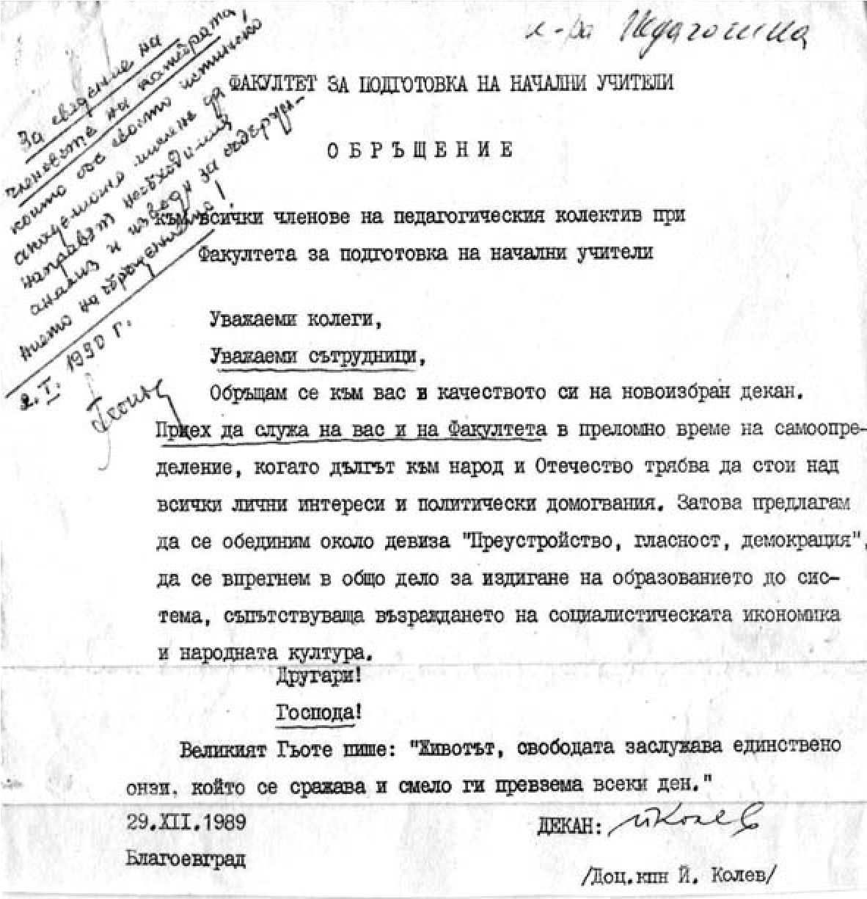

# 8. Превратът, организиран от комунистите в Педагогическия факултет

На 29 ноември през 1989 г. се проведе Общото събрание на Факултета за подготовка
на начални учители. То бе специално подготвено от Факултетния комитет на БКП. В
навечерието на събранието беше направена анкета сред преподавателите от
факултета, в която трябваше да се даде отговор на въпроса: „Кой според вас
трябва да бъде избран за декан на факултета?“ Моето име посочиха най-голям
процент от анкетираните преподаватели и студенти. Това постави в тревога
факултетния комитет на БКП, който разработи подробен сценарий, по който трябваше
да се извърши подготовка за избор на декан от комунистите във факултета.

В отчетния доклада на декана доц. Васил Стамов бяха отразени някои сериозни
нарушения на академичната атмосфера във факултета от преподаватели, между които
имаше и членове на бюрото на факултетния комитет на БКП. Специално място беше
отделено на незаконното прехвърляне на Йордан Колев от специалност „Предучилищна
педагогика“ в специалност „Начална училищна педагогика“, което беше в нарушение
на Закона за висше образование и Правилника за неговото спазване. Отчетено бе,
че в продължение на две години той не е заемал работното си място в катедрата.

По време на Общото събрание секретарят на ФК на БКП Кирил Костов прескачаше от
човек на човек, за да подготви избора на техния кандидат за декан. Йордан Колев
се появи една-две минути преди закриването на събранието, когато вече беше
постъпило предложение да се прекъснат изказванията. Специално подбраният водещ
на събранието от факултетния комитет на БКП проф. Ал. Маджаров, известен като
номенклатурен кадър на ЦК на БКП, имаше определена роля по сценария, възложена
му от партийното бюро на факултета. Той често поглеждаше към входната врата.
Личеше, че е неспокоен. Най-после се появи този, когото видимо очакваше.

Йордан Колев се доближи до проф. Маджаров и му прошепна нещо, което никой не
разбра. Но всичко стана ясно, когато беше дадена думата на секретаря по
идеологическите въпроси на Вузовския комитет на БКП. Всички чуха необузданото
слово на мераклията за декан на Педагогическия факултет.

Колев започна словото си с думите:

&minus;Колеги, аз изчаках да свършат градивните изказвания и затова закъснях,
    защото вие ще разберете от изказването ми, че не мога да бъда градивен...
    (вж.стенограмата от заседанието на Общото събрание на ФПНУ, състояло се на
    29.11.1989 г.).

Подготвените да направят преврат във факултета вече постигнаха първия си успех
още на Общото събрание на университета, на което в резулатат на изключително
активната им дейност аз и другите от предишното деканско ръководство не бяхаме
избрани в Академичния съвет.

По-нататък „ораторът“ Колев специално продължи цял час своето екзалтирано
изказване, което преливаше от жлъчни, нечестиви, неприсъщи за университетски
преподавател думи и изрази. Отправи клевети и лъжи срещу цялото деканско
ръководство и някои други колеги от факултета. Слушах го спокоен и си спомних
казаното от проф. Ж. Атанасов, че “от него не става учен, а само монтьор или пък
партиен пропагандист“. Сетих се и за думите на един от моите колеги, че след
като Колев стане доцент, ще забрави как е хленчил за помощ и ще започне неистова
война срещу мен. Жлъчното, арогантно и свадливо слово на Колев завърши с
призива:“Вашето време изтече! Внимавайте, колеги. Аз имам платформа!“

В своето „партийно“ слово ораторът се издаде, че партията му е подготвила
„шамара“, който сме получили с изолирането ни от Академичния съвет. Не отмина
обаче оспорваната и определена като неправилна процедура, свързана с неговото
прехвърляне от една спецалност в един факултет в друга специалност в друг
факултет. Издаде се, че това е било „партийно поръчение“ и заяви с гордост:

&minus;Това е линия на ОК на БКП. Четиринадесет човека бяхме поканени главни
    асистенти, кандидати на науките, с цел да ни се даде възможност по-бързо да
    се хабилитираме, за да заемем ръководни длъжности.

Партийният лидер Колев се оплака, че аз не съм уважавал нито партийното бюро на
факултета, нито партийната група на катедрата и не съм се отзовавал на техните
покани за разговори, с което съм явно изразявал моята антипартийна линия в
работата ми като зам.-декан и ръководител на катедра.

Нужни са истински нравствени ценности и утвърдена, проверена академична култура
на поведение, за да се издържи пред подобни необуздани хули и клевети.
Изказването на Колев беше жлъчно, арогантно, свадливо. Слушах го и оживяваха в
паметта ми онези минути, когато Колев идваше често при мен съвсем друг –
подгърбен и с тих, кадифен глас, но с издаващи своята хитрост очи, ме молеше за
помощ. Мълчах и си мислех за морала на комуниста Колев.

Партийната организация във факултета беше вдигнала на крак всички нейни членове.
С помощта на специално подготвеното екзалтирано слово на Йордан Колев тя
постигна „пирова победа“. В състава на Факултетния съвет не бе избран нито един
от предишното деканско ръководство. Мечтата на Колев се сбъдна. Той беше уверен,
че ще бъде новият декан на факултета.

На следващата сутрин, след проведеното бурно Общо събрание, превзето от
комунистите във факултета, в кабинета ми дойде колежка, която като ме погледна,
се разплака и ми каза:

&minus;Страхувам се, че ако Йорда Колев бъде избран за декан, ще превърне факултета
    ни в червена крепост. Вие сте силен, много силен, щом издържахте на ударите
    на комунистите. Другите от деканското ръководство ги няма, а вие сте на
    работното си място, както винаги пръв и спокоен.

&minus;Имам закалка, колежке! Те друго не могат, освен да нанасят удари срещу своя
    враг. На това ги е научила партията им. Техните удари обаче не ме плашат,
    защото знам, че се страхуват от мен.

На 27.10.1989 г. от 14 часа след обяд се провежда второто по ред заседание на
Факултетния съвет за избор на декан. Заседанието се ръководи не от който и да е,
а от дясната ръка на Йордан Колев – доц. Лиляна Тодорова, която преди да бъде
назначена в нашия институт, беше известна като комсомолски деятел и специалист
по проблемите в ДПО „Септемврийче“ и четите „Чавдарче“.

Доц. Иван Кадийски напомня за другата точка, вписана в поканата, свързана с
докладната на бившето деканско ръководство за закононарушения, фалшификации и
дисциплинарни нарушения на преподаватели от мандатния период, които се отнасят
за онези, които сега вече превзеха Факултетния съвет и очакват да оглавят
неговото ръководство. Ректорът проф. Илия Конев потвърждава, че е получена в
ректората такава докладна записка и е решено да се сформира комисия, която да
провери за достоверността на изнесеното в нея. Но след това всичко се покрива.
На предишното заседание кандидатурата на Йордан Колев за декан, по негово
признание, е била издигната от обществените организации, т.е. от партийния
комитет на факултета, но въпреки това не бил избран.

На последното заседание на факултетния съвет са предложени няколко кандидати за
декани (проф. М.Тачева, гл.ас. Виолета Боянова и др.), но те си дават отвод. Не
си дават отвод само бившите комсомолски и партийни деятели Йордан Колев и Лиляна
Тодорова, които се надпреварват за деканското място. Какъв парадокс! Това са
онези, за които се подчертаваше в доклада на предишното деканско ръководство за
допуснати груби нарушения при тяхното незаконно прехвърляне в този факултет и
закононарушения при научното им израстване.

По подготвения сценарий от факултетното партийно ръководство Йордан Колев е
избран за декан, а Лиляна Тодорова, гл.ас. Михо Михов и гл.ас. Кристина Попова –
за зам.-декани.

Това бяха дните, когато се постави началото на вече подготвения от ЦК на БКП и
Държавна сигурност посткомунистически преход в България. Комунистите и
комсомолците започнаха да окупират катедрените, деканските и ректорското
ръководство на нашия университет.

Още при незаконното преместване на Йордан Колев от Факултета за предучилищна
педагогика в Педагогическия факултет някои преподаватели напуснаха Катедрата по
педагогика. Доц. Мария Белова и доц. Георги Стоянов се преместиха в Софийския
университет. След това, когато новият декан и партийният секретар се развихриха
като победители в битката за овладяване на ръководството на Педагогическия
факултет, трима колеги от Катедрата по физическо възпитание също напуснаха
преподавателската си работа. Неочаквано две от колежките, асистентки по история
на педагогиката от нашата катедра, ги последваха. Изчезнаха и някои
преподаватели от Педагогическия факултет, които бяха на трудов договор. Един от
тях дойде при мен и ми каза:

&minus;Доц. Попов, очаквайте ново попълнение във вашата катедра, което е от
    червения цвят. Новият декан вече го е подбрал.

С участието на общинския съвет на БСП в Благоевград Йордан Колев фабрикуваше
фалшификати срещу мен и завеждаше съдебни дела, които се проваляха едно след
друго. Това бяха двете „опорни точки“ по които се водеше борбата от червените
срещу мен. Един от тогавашните съдии ме попита:

&minus;Защо не го съдите? Той ви нанесе толкова тежки, незаслужени обиди и клевети,
    заради които може да получи немалка заслужена присъда.

И мои добри приятели ми даваха този съвет, но аз не го приемах, защото беше под
достойнството ми да съдя един школуван от комунистическата партия несменяем
партиен секретар. Като такъв Колев се определя сам в своята автобиография.

> *Още от първите дни жадуващият за деканския престол Йордан Колен излезе с
> обръщение към всички членове на педагогическия колектив при Факултута за
> подготовка на начални учители, в което ги призова „за издигане на образованието
> до система, съответстваща възраждането на с о ц и а л и с т и ч е с к а т а
> икономика и народната култура“. На първо място в обръщението се обърна към
> своите „другари“.*

